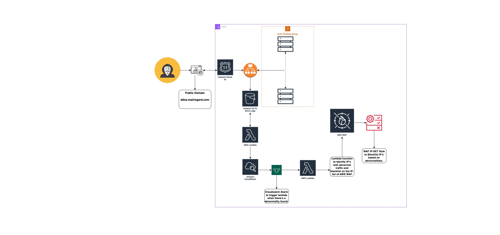

# CyberNeura: The Next-Gen CyberBarrier 🚀🛡️

## Project Overview
**CyberNeura** stands at the cutting edge of cybersecurity, harnessing the power of artificial intelligence to deliver unmatched DDoS protection. In its **R&D phase**, CyberNeura is set to redefine security paradigms by dynamically analyzing traffic patterns, intelligently identifying threats, and safeguarding digital realms against the most cunning cyber adversaries.

### 🚧 Project Status: R&D Phase
CyberNeura is deep in the trenches of research and development. Our team of visionaries is weaving the latest AI breakthroughs into the fabric of CyberNeura, crafting a self-evolving defense mechanism that aims to surpass existing cybersecurity benchmarks.

### 🌌 Architecture Overview
CyberNeura's architecture melds strength with agility, embedding state-of-the-art AI algorithms for instantaneous threat recognition and neutralization.

#### 📐 CyberNeura Architecture Diagram

### 🛠 Technical Details
- **AI-Driven Analysis**: Leverages machine learning and neural networks to dissect traffic flows and pinpoint threats.
- **Real-Time Mitigation**: Deploys intelligent countermeasures in the blink of an eye to fend off attacks.
- **Adaptive Learning**: Evolves with each data packet, refining its defensive strategies continuously.

### 🌠 Future Directions
AI is the nucleus of CyberNeura's evolutionary path. The journey ahead is charted towards integrating predictive analytics and autonomous response mechanisms, ensuring CyberNeura remains the vanguard of cybersecurity defenses.

### 🤝 Contributing
As CyberNeura navigates the R&D odyssey, we invite the brilliant minds from cybersecurity and AI domains to join forces with us. Share your insights, propose enhancements, or fortify our code. Your expertise is the catalyst for our collective success.

---

Embrace the future with CyberNeura, where AI meets cybersecurity to create an impenetrable sanctuary for your digital assets. 🌐✨
